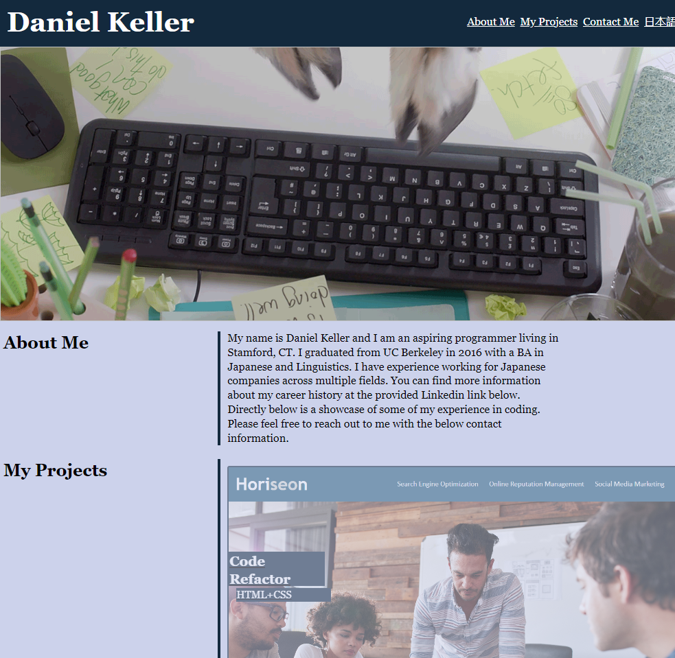
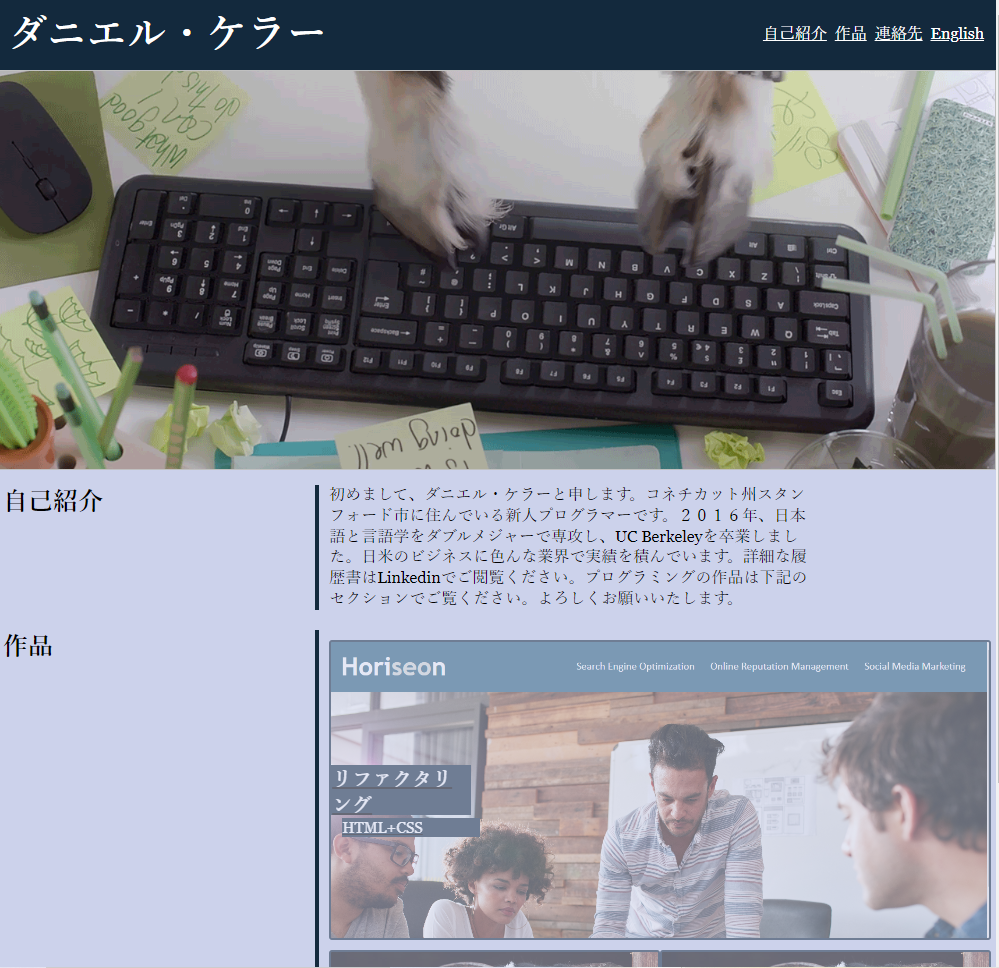

# HW-2-Professional Profile

## Description

This is a first pass at a professional portfolio site used to provide information about me to potential recruiters and hiring managers. This site is itself intended to be showcase of my skills in CSS and HTML. This site was prepared entirely from scratch.

I attempted to create a Japanese version of this site as in the future I hope to leverage my bilingual skills in my job hunt. This resulted in several unexpected formatting and text alignment issues most of which I was able to resolve. However, the differing text lengths still present some lingering formatting issues.

The site can be accessed at the following url: https://dbanfieldkeller.github.io/HW-2-Professional-Portfolio/

The website should appear as in the below screenshots:

